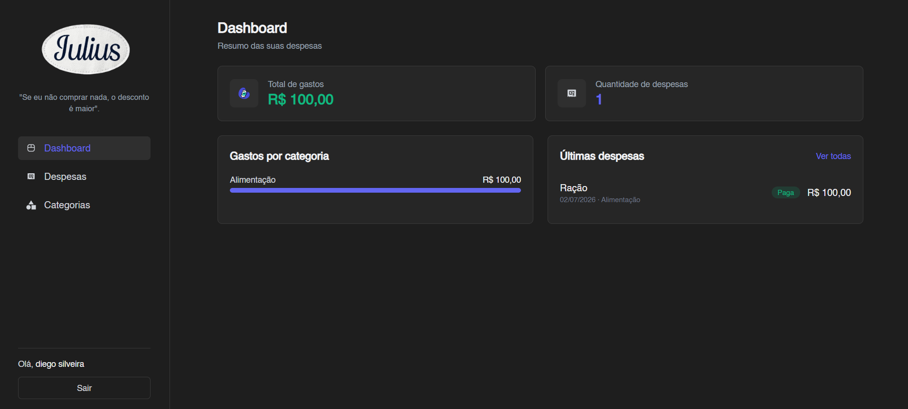
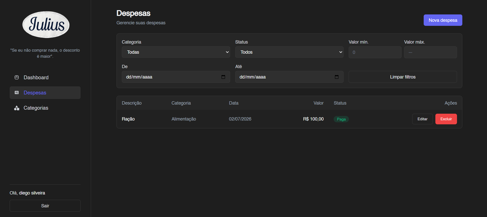
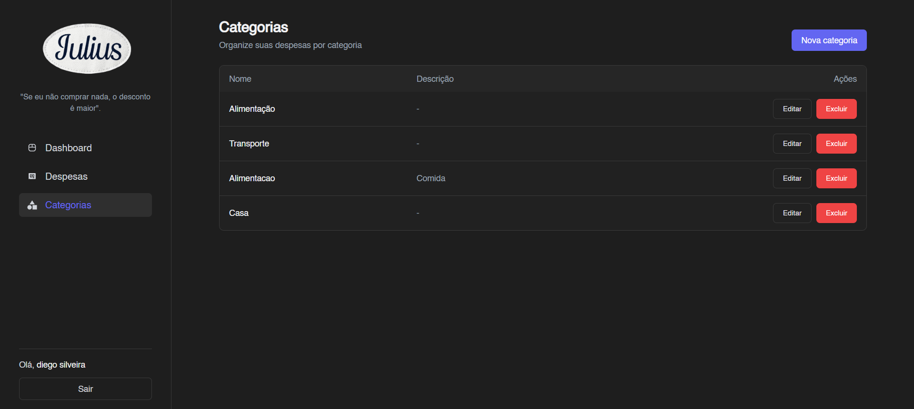
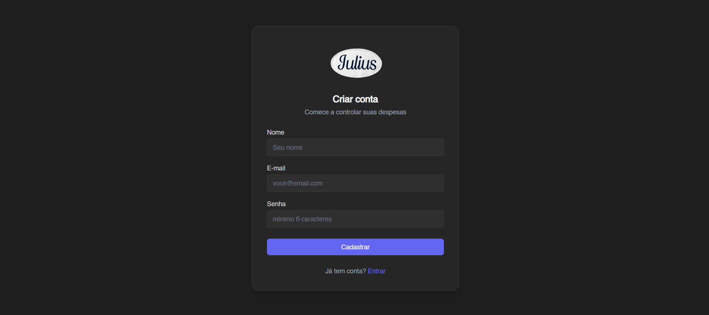

# Julius — Frontend (Controle de Despesas)

Aplicação React para controle de despesas pessoais, integrada à API RESTful do backend.

## Tecnologias

- **React 19** + **Vite**
- **React Router DOM 7** (rotas e proteção de rotas)
- **Axios** (camada de serviços com interceptors de token/erro)
- **Context API** (estado global de autenticação e de feedback/toasts)
- **Tailwind CSS 4** (tema escuro)

## Funcionalidades

- **Autenticação**: login, cadastro, persistência de sessão (localStorage) e logout.
- **Dashboard**: total de gastos, quantidade de despesas, gastos por categoria (barras) e últimas despesas.
- **Categorias**: CRUD completo (listar, criar, editar, excluir).
- **Despesas**: CRUD completo com **filtros** por categoria, status, intervalo de datas e faixa de valor.
- **UX**: interface responsiva, loading states, tratamento de erros, feedback visual (toasts) e formulários validados.

## Telas

### Dashboard



### Despesas (listagem + filtros)



### Categorias



### Cadastro



## Pré-requisitos

- Node.js 18+
- Backend em execução (ver seção abaixo).

## Como rodar

### 1. Backend (API)

No projeto `personalExpenses/api-despesas-pessoais`:

```bash
docker-compose up -d   # sobe o PostgreSQL
npm install
npm run db:migrate     # cria as tabelas
npm run db:seed        # (opcional) dados de exemplo
npm start              # API em http://localhost:3000
```

### 2. Frontend

Neste projeto:

```bash
npm install
npm run dev            # app em http://localhost:5173
```

Abra <http://localhost:5173>, crie uma conta em **Cadastre-se** e faça login.

> **Integração / CORS:** o Vite faz _proxy_ de `/api` para `http://localhost:3000`
> (ver `vite.config.js`). Assim o navegador conversa com a API na mesma origem,
> sem necessidade de configurar CORS no backend.

## Variáveis de ambiente

Arquivo `.env` (veja `.env.example`):

```
VITE_API_URL=/api
```

Em desenvolvimento, `/api` usa o proxy do Vite. Para apontar direto ao backend,
use `VITE_API_URL=http://localhost:3000/api`.

## Estrutura

```
src/
├── components/   # UI reutilizável (Button, Input, Modal, ...) + Layout e componentes de domínio
├── contexts/     # AuthContext, ToastContext (estado global)
├── hooks/        # useAuth, useToast
├── pages/        # Login, Register, Dashboard, Categories, Expenses
├── routes/       # AppRoutes, ProtectedRoute
├── services/     # api (Axios) + serviços por domínio (auth, categorias, despesas, dashboard)
└── utils/        # formatação (moeda/data) e validações de formulário
```

## Scripts

- `npm run dev` — servidor de desenvolvimento
- `npm run build` — build de produção
- `npm run preview` — pré-visualiza o build
- `npm run lint` — ESLint
